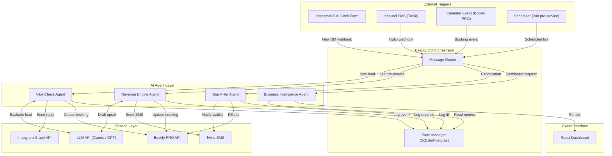
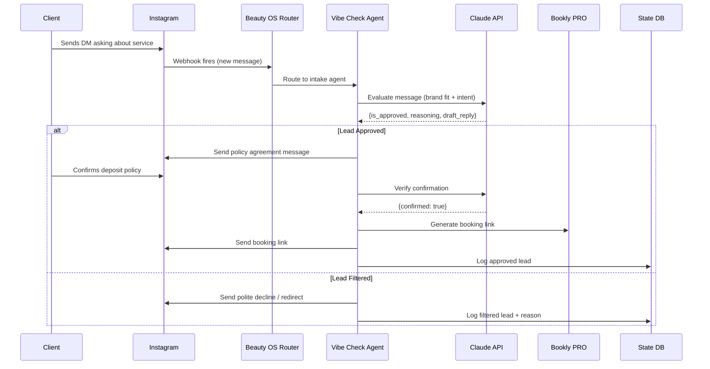

# Beauty OS — System Architecture

## Agentic Architecture Overview

Beauty OS is an autonomous "Studio Manager" that proactively manages a beauty
professional's business. It uses four AI agents coordinated by a central
orchestrator.

## Data Flow: Instagram DM → Booking

## Data Models

### Client Record
| Field            | Type     | Description                        |
|------------------|----------|------------------------------------|
| id               | UUID     | Primary key                        |
| name             | string   | Client display name                |
| phone            | string   | For SMS (E.164 format)             |
| instagram_handle | string   | IG username                        |
| intake_status    | enum     | pending / approved / declined      |
| vibe_score       | float    | 0.0–1.0 brand-fit score            |
| intake_reasoning | text     | LLM explanation                    |
| created_at       | datetime | First contact                      |

### Booking Record
| Field          | Type     | Description                          |
|----------------|----------|--------------------------------------|
| id             | UUID     | Primary key                          |
| client_id      | UUID     | FK → Client                          |
| service        | string   | Primary service booked               |
| add_ons        | json     | Array of upsell add-ons accepted     |
| original_price | decimal  | Base price                           |
| final_price    | decimal  | After add-ons                        |
| scheduled_at   | datetime | Appointment time                     |
| status         | enum     | confirmed / cancelled / completed    |
| source         | enum     | instagram / web / referral           |

### Waitlist Entry
| Field        | Type     | Description                         |
|--------------|----------|-------------------------------------|
| id           | UUID     | Primary key                         |
| client_id    | UUID     | FK → Client                         |
| service      | string   | Desired service                     |
| preferred_at | datetime | Preferred time window               |
| notified     | boolean  | Already contacted for a gap?        |

### Agent Event Log
| Field      | Type     | Description                           |
|------------|----------|---------------------------------------|
| id         | UUID     | Primary key                           |
| agent      | enum     | vibe_check / revenue / gap_filler     |
| action     | string   | What the agent did                    |
| metadata   | json     | Context (client_id, revenue, etc.)    |
| created_at | datetime | Timestamp                             |
